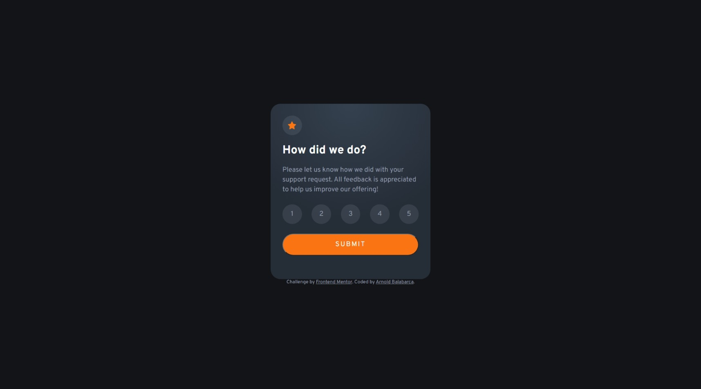

# Frontend Mentor - Interactive rating component solution

This is a solution to the [Interactive rating component challenge on Frontend Mentor](https://www.frontendmentor.io/challenges/interactive-rating-component-koxpeBUmI). Frontend Mentor challenges help you improve your coding skills by building realistic projects. 

## Table of contents


- [Overview](#overview)
  - [Screenshot](#screenshot)
  - [Links](#links)
- [My process](#my-process)
  - [Built with](#built-with)
  - [What I learned](#what-i-learned)
  - [Useful resources](#useful-resources)
- [Author](#author)

## Overview

### Screenshot




### Links

- Solution URL: [GitHub](https://github.com/arn28/interactive-rating-component.git)
- Live Site URL: [Vercel](http://interactive-rating-component-arn28.vercel.app/)

## My process

### Built with

- HTML box model
- Flexbox
- Mobile-first workflow

### What I learned

After making the HTML structure, I started by linking the font families and creating some global variables for  color.
I set propierties box-sizing: border-box;, setting marging and padding to 0, so I can set the size and margin of elements easily.
Also, I set some proprieties by default such as font-family.
I used flexbox and its properties to organize the elements and make them responsive.
For the active state I used the ':hover' selector
```css
.ratingComponent .ratingState .ratingOptions div:hover{
  color: var(--white);
  background-color: var(--orange);
}

.ratingComponent .ratingState input[type="submit"]:hover{
  background-color: var(--white);
  color: var(--orange);
}
```
one of the interesting JavaScript code I used was this 
```js
  propRating.messageContainer.innerHTML = '<p>You selected '+ propRating.ratingValue +' out of 5</p>'      
```
With 'innerHTML' I can easily add HTML into an element selected and convine with other variables. 


### Useful resources

- [HTML box model](https://www.w3schools.com/css/css_boxmodel.asp) - This helped me undertanding the boc moddel we have to follow at maketing a web site.

- [CSS flexbox](https://css-tricks.com/snippets/css/a-guide-to-flexbox/) - This is an amazing guide which helped me finally understand Flexbox properties. I'd recommend it to anyone still learning this concept.

- [CSSmatic - Gradient Generator](https://cssmatic.com/gradient-generator) - This is a useful tool for creating great gradients in an easy way, there are also other tools like Border Radius, Noise Texture and Box Shadow Generator.  
- [W3School] (https://www.w3schools.com/) - This helped me a lot with many examples and explanation for different programming languages.

## Author

- Github - [Arnold Balabarca](https://github.com/arn28)
- Frontend Mentor - [@arn28](https://www.frontendmentor.io/profile/arn28)

